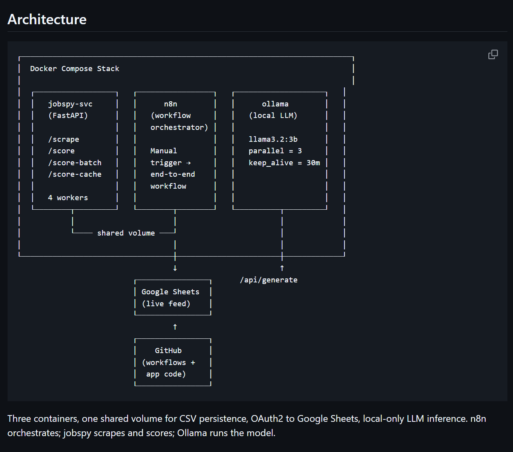
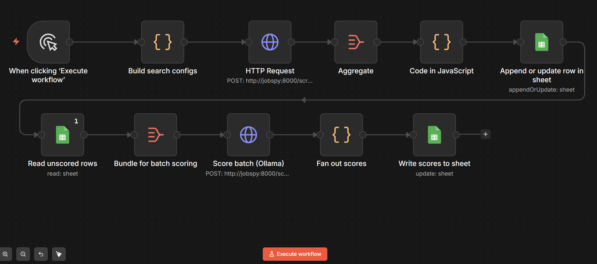
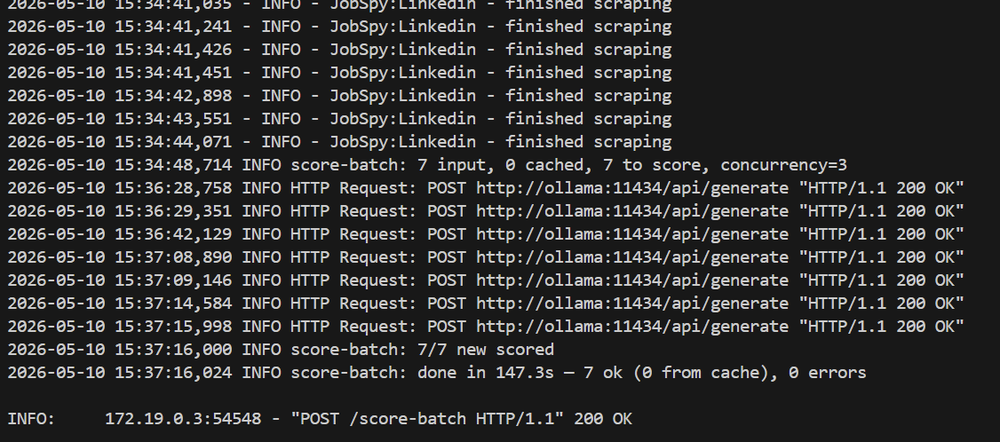
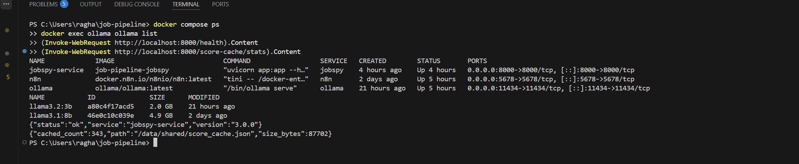

# Job Pipeline

A containerised, end-to-end job-search automation pipeline. Scrapes job boards, deduplicates listings, persists them to Google Sheets, and scores each role against a structured candidate profile using a local LLM. Runs entirely on a developer laptop — no API keys, no cloud dependencies, no per-token cost.

> 💡 **New here?** If you want to run this on your own laptop, follow the step-by-step guide in [`docs/SETUP.md`](docs/SETUP.md). Expect about 60–90 minutes including Google OAuth setup.

Built as a portfolio project for a Dublin-based BA / Data Analyst job search across Ireland and the UK.



---

## Performance

Real numbers from a complete production run:

- **~190 unique jobs per scrape run** across 4 role families × 2 geos
- **~5 minutes** for the scrape phase (8 parallel HTTP calls, deduped, upserted)
- **~6 seconds** average LLM scoring latency per job (Llama 3.2 3B, local)
- **~48 minutes** for full scoring of 335 jobs at concurrency = 3
- **336 cached scored jobs** persisted in 86 KB of JSON on disk
- **0 API cost** — all inference runs on the developer laptop
- **0 errors** in the most recent full scoring pass (335/335 success)
- **Re-run latency** for already-scored URLs: <10 milliseconds (disk cache hit)

---

## How it's wired

The n8n workflow stitches the whole pipeline together. One trigger fires the entire flow:



Three containers, one shared volume for CSV persistence, OAuth2 to Google Sheets, local-only LLM inference. n8n orchestrates; jobspy scrapes and scores; Ollama runs the model.

---

## Phases

- [x] **Phase 1** — Containerised scraping service (FastAPI + python-jobspy)
- [x] **Phase 2** — Google Sheets integration via OAuth2 with idempotent schema
- [x] **Phase 3** — Multi-search loops (4 role families × 2 geos) with deduplication and upsert
- [x] **Phase 4** — Local LLM scoring (Ollama + llama3.2:3b) with disk-backed cache

---

## What it does

A single click in n8n triggers the full pipeline:

1. **Scrape** — 8 parallel searches across Indeed and LinkedIn (4 role families × 2 geos)
2. **Aggregate** — collect all responses into a single bundle
3. **Deduplicate** — remove URL collisions across searches (same job in BA + Systems searches counts once)
4. **Upsert** — append new rows or update existing ones in Google Sheets, matched on `job_url`
5. **Score** — read unscored rows, batch-send to local LLM via the `/score-batch` endpoint, get back a 0-10 fit score plus one-sentence reason for each
6. **Persist scores** — write `fit_score` and `fit_reason` back to the sheet

Re-running the workflow is safe: existing jobs are upserted (not duplicated), and already-scored jobs come from the disk cache in milliseconds instead of 6 seconds of inference.

---

## The candidate profile

The scorer is fed a structured JSON profile covering:
- Current location, willingness to relocate, right to work
- Experience (years, current and previous employers, domains)
- Education and certifications
- Core skills grouped by capability cluster
- Target roles (preferred / acceptable / avoid)
- Salary expectations and industry preferences

Stored in `jobspy-service/profile.json` and loaded fresh on every scoring call so iterations don't require a rebuild.

---

## Phase 1 — Containerised scraping service

**Stack:** Python 3.11, FastAPI, python-jobspy, pandas, Pydantic.

A POST to `/scrape` accepts:
- `search_term` (e.g. "Senior Business Analyst")
- `location` (e.g. "Dublin, Ireland")
- `sites` (Indeed, LinkedIn, Glassdoor, ZipRecruiter, Google, Naukri, Bayt — defaults to Indeed + LinkedIn)
- `results_wanted`, `hours_old` (recency window)
- `country_indeed` (auto-inferred from location if omitted)
- `role_family` (used as a CSV filename tag)
- `save_csv` flag

Returns a structured response with per-job metadata and writes a CSV to a shared Docker volume (`/data/shared/jobs_<family>_<timestamp>.csv`).

The country inference handles Ireland, UK, Netherlands, Germany, France and Indian cities (Bangalore, Mumbai, Delhi).

**One subtle decision:** the `/scrape` endpoint returns plain dicts, not Pydantic-validated response models. python-jobspy returns pandas DataFrames containing NaN values, which Pydantic rejects. Plain dicts pass through cleanly.

---

## Phase 2 — Google Sheets integration

OAuth2 setup in Google Cloud (own project, OAuth client ID, redirect URI, consent screen), then n8n's Google Sheets credential authenticates against it. The sheet has 16 columns, A-P:

```
scraped_at | role_family | site | title | company | location | date_posted
| is_remote | job_url | min_amount | max_amount | currency | search_term
| description | fit_score | fit_reason
```

A debugging note worth preserving: column headers are whitespace-sensitive in n8n's auto-mapping. Trailing or leading spaces in the sheet (invisible to the eye) silently cause schema mismatches at insert time. Diagnostic: `=LEN(E1)` in any empty cell — should match the column name length exactly.

---

## Phase 3 — Multi-search loop with idempotent upsert

A "Build search configs" Code node emits 8 items per click — one per (role_family × geo) combination — and feeds them into the HTTP Request node which loops automatically. The 8 responses are aggregated into a single bundle, flattened, deduplicated by `job_url`, then upserted to the sheet.

The idempotent upsert pattern means the workflow can run any number of times per day. Existing rows update their `scraped_at` timestamp; new jobs append. The sheet always reflects the current state of the market, not the cumulative scrape history.

---

## Phase 4 — Local LLM scoring with disk-backed cache

**Why local LLM:** No API costs, no rate limits, no data leaving the developer's machine. Production-relevant for any company handling sensitive candidate or job data.

**Why a disk cache:** Each scoring call takes ~6 seconds of inference. A full run of 335 jobs takes ~48 minutes. Without a cache, any downstream failure (n8n timeout, network blip, container restart) means re-scoring from scratch. With the cache, scored URLs are persisted to `/data/shared/score_cache.json` mid-run (every 25 items) and survive process restarts. Re-runs return cached results in milliseconds.

After the first full pass: **336 cached scores in 86 KB of JSON.** A re-run of the same data completes in seconds, not minutes.

The batch scoring service logs progress in real time:



### The architectural pivot worth describing

The first attempt put the scoring loop inside n8n: read 312 unscored rows, call `/score` once per row in a Loop Over Items node. Every iteration of this design failed at scale.

Diagnosis revealed three independent schedulers with conflicting assumptions about concurrency, timeouts, and backpressure: n8n's loop semantics, FastAPI's worker model, and Ollama's inference queue. The orchestrator (n8n) couldn't safely manage long-duration concurrent state across hundreds of items. PowerShell calls to the same endpoint succeeded perfectly with identical concurrency — proving the bottleneck wasn't compute but orchestration.

**The fix was an ownership boundary change:** move iteration, retries, concurrency control, and partial-failure handling out of n8n and into the Python service.

The new `/score-batch` endpoint accepts an array of jobs, uses `asyncio.Semaphore(3)` to bound Ollama concurrency, persists progress to the cache every 25 items, captures per-item errors without aborting the batch, and returns a single structured response with success/error counts and elapsed time. n8n now makes one HTTP call (with a 90-minute timeout) instead of looping over 300+ items.

This is the architectural pattern that distinguishes workflow orchestrators from compute schedulers: orchestrators route work across systems and trigger pipelines; compute schedulers manage queues, retries, concurrency, and durable state. Each is good at one and bad at the other.

---

## Local setup

Prerequisites: Docker Desktop, Git, PowerShell (Windows) or bash, ~8 GB free disk for the Llama 3.2 3B model.

```powershell
git clone https://github.com/Ayushman-Raghav/job-pipeline.git
cd job-pipeline
cp .env.example .env       # No secrets needed for local LLM, but creates the file
docker compose up -d
docker exec -it ollama ollama pull llama3.2:3b
```

Wait for all containers to report `Up`, then verify:

```powershell
(Invoke-WebRequest http://localhost:8000/health).Content
docker exec ollama ollama list
```

The full container stack at idle:



Then open n8n at http://localhost:5678, import `workflows/job-pipeline-phase-4.json`, configure your Google Sheets OAuth2 credential, and click **Execute workflow**.

First run takes ~5 min for scraping plus ~50 min for scoring 300+ jobs. Subsequent runs take ~5 min for scraping and a few minutes for sheet updates because scoring comes from the cache.

---

## Endpoints

| Method | Path | Purpose |
|---|---|---|
| GET | `/health` | Liveness probe with version |
| GET | `/sources` | List supported job boards |
| GET | `/role-families` | Return canonical role taxonomy |
| GET | `/files` | List CSVs in shared volume |
| GET | `/profile` | Inspect the loaded candidate profile |
| GET | `/score-cache/stats` | Inspect the cache (count, path, size) |
| DELETE | `/score-cache` | Clear the cache (e.g. after profile changes) |
| POST | `/scrape` | Scrape one (search × location), optionally save CSV |
| POST | `/score` | Score one job synchronously |
| POST | `/score-batch` | Score many jobs concurrently with caching |

### Example scrape request

```bash
curl -X POST http://localhost:8000/scrape \
  -H "Content-Type: application/json" \
  -d '{
    "search_term": "Senior Business Analyst",
    "location": "Dublin, Ireland",
    "sites": ["indeed", "linkedin"],
    "results_wanted": 15,
    "hours_old": 168,
    "role_family": "BA",
    "save_csv": true
  }'
```

Returns:

```json
{
  "search_term": "Senior Business Analyst",
  "location": "Dublin, Ireland",
  "sites_queried": ["indeed", "linkedin"],
  "role_family": "BA",
  "scraped_at": "2026-05-10T11:43:01.540123",
  "count": 27,
  "csv_path": "/data/shared/jobs_ba_20260510_114301.csv",
  "jobs": [ /* per-job records */ ]
}
```

### Example batch scoring request

```bash
curl -X POST http://localhost:8000/score-batch \
  -H "Content-Type: application/json" \
  -d '{
    "jobs": [
      {
        "title": "Senior Data Analyst",
        "company": "Stripe",
        "location": "Dublin, Ireland",
        "description": "Build dashboards in Looker, write SQL across Snowflake, partner with finance and product teams. 5+ years experience required.",
        "job_url": "https://example.com/job/1"
      }
    ]
  }'
```

Returns:

```json
{
  "results": [
    {
      "job_url": "https://example.com/job/1",
      "score": 9,
      "reason": "Excellent fit on role, level, location, skills, and industry preference for a senior data analyst.",
      "error": null
    }
  ],
  "model": "llama3.2:3b",
  "total_seconds": 6.1,
  "success_count": 1,
  "error_count": 0
}
```

---

## Repository layout

```
job-pipeline/
├── docker-compose.yml              ← 3 services + named volumes + bridge network
├── jobspy-service/
│   ├── Dockerfile                  ← Python 3.11-slim base, 4 uvicorn workers
│   ├── requirements.txt            ← fastapi, jobspy, httpx, pandas, pydantic
│   ├── app.py                      ← FastAPI service: /scrape, /score, /score-batch
│   └── profile.json                ← Candidate profile (skills, target roles, preferences)
├── workflows/
│   ├── job-pipeline-phase-2.json   ← Single-search version (historical)
│   ├── job-pipeline-phase-3.json   ← Multi-search + dedupe + upsert
│   └── job-pipeline-phase-4.json   ← Current — adds LLM scoring branch
├── shared-data/                    ← Gitignored; holds CSVs and score cache
├── assets/                         ← README screenshots
├── README.md
├── .env                            ← Gitignored; copied from .env.example
├── .env.example                    ← Template for local config
└── .gitignore                      ← Protects secrets, CSVs, cache, _archive/
```

---

## Future improvements

- **Redis-backed cache** to share scoring state across multiple jobspy instances (currently single-node)
- **Postgres persistence layer** for jobs and scores instead of Google Sheets — with proper schema, indexes, and history tables
- **Embedding-based semantic matching** as a first-pass filter before LLM scoring (cheap recall, expensive precision)
- **Email or Slack daily digest** with the top N new high-fit roles via n8n's notification nodes
- **Progress polling endpoint** for long-running scoring (`/score-batch` returns a job_id, client polls `/score-batch/{id}/status`)
- **Kubernetes deployment** with horizontal scaling on the jobspy service and a shared Ollama pool
- **JD-to-MCQ generator endpoint** that produces interview-prep questions from a high-fit job description

---

## What I learned building this

**Workflow orchestrators are not compute schedulers.** n8n is excellent for routing events, integrating APIs, and lightweight ETL. It is not the right place to manage AI inference queues, retry policies, or partial-failure logic over hundreds of items. Recognising this — and moving the loop into Python — was the breakthrough that turned a fragile pipeline into a stable one.

**Idempotency is a feature, not an optimisation.** Designing the upsert pattern (match on `job_url`, update if present, append if new) meant every operational decision afterwards became simpler. Re-runs are safe. Failed runs can be retried. Cached scores persist across container restarts.

**Local-first AI is a real production concern, not just a hobbyist preference.** Many organisations — finance, healthcare, legal, government — cannot send candidate or job data to third-party APIs. A pipeline built around Ollama + bounded concurrency demonstrates the architectural patterns those environments require.

**Model size matters less than prompt clarity.** Llama 3.2 3B (a 2 GB model) discriminates correctly between target roles and avoid-list roles, between senior and junior seniority, and between preferred and avoided industries. The structured profile JSON does most of the heavy lifting; the model just needs to follow instructions.
